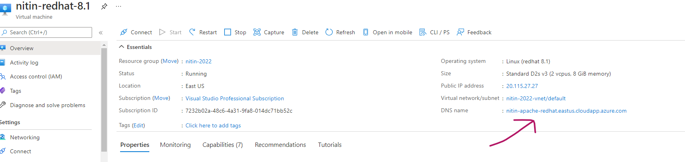
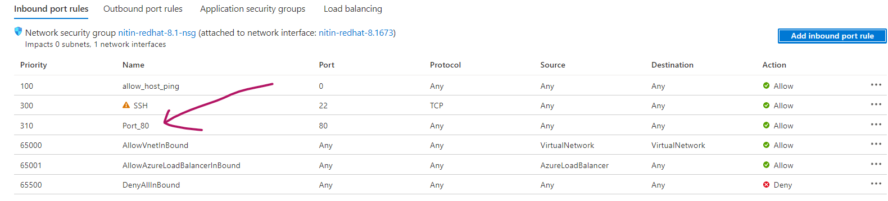
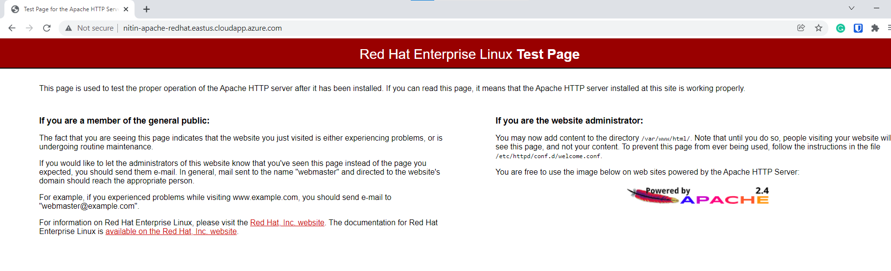

# install apache

- install httpd

```text
[root@nitin-redhat-8 ~]# yum install httpd
Last metadata expiration check: 0:57:49 ago on Sat 18 Dec 2021 02:37:04 AM UTC.
Dependencies resolved.
================================================================================================================================================== 
 Package                                          Architecture                         Version                                                                 Repository                                                               Size
================================================================================================================================================== 
Installing:
 httpd                                            x86_64                               2.4.37-16.module+el8.1.0+13088+25b5ebf7.2                               rhel-8-for-x86_64-appstream-eus-rhui-rpms                               1.4 M
Installing dependencies:
 redhat-logos-httpd                               noarch                               81.1-1.el8                                                              rhel-8-for-x86_64-baseos-eus-rhui-rpms                                   26 k
 apr-util                                         x86_64                               1.6.1-6.el8                                                             rhel-8-for-x86_64-appstream-eus-rhui-rpms                               105 k
 mod_http2                                        x86_64                               1.11.3-3.module+el8.1.0+7763+babdfe5b.1                                 rhel-8-for-x86_64-appstream-eus-rhui-rpms                               157 k
 apr                                              x86_64                               1.6.3-9.el8                                                             rhel-8-for-x86_64-appstream-eus-rhui-rpms                               125 k
 httpd-tools                                      x86_64                               2.4.37-16.module+el8.1.0+13088+25b5ebf7.2                               rhel-8-for-x86_64-appstream-eus-rhui-rpms                               103 k
 httpd-filesystem                                 noarch                               2.4.37-16.module+el8.1.0+13088+25b5ebf7.2                               rhel-8-for-x86_64-appstream-eus-rhui-rpms                                35 k
Installing weak dependencies:
 apr-util-openssl                                 x86_64                               1.6.1-6.el8                                                             rhel-8-for-x86_64-appstream-eus-rhui-rpms                                27 k
 apr-util-bdb                                     x86_64                               1.6.1-6.el8                                                             rhel-8-for-x86_64-appstream-eus-rhui-rpms                                25 k
Enabling module streams:
 httpd                                                                                 2.4

Transaction Summary
================================================================================================================================================== 
Install  9 Packages

```

- verify httpd version
```text
[root@nitin-redhat-8 ~]# httpd -v
Server version: Apache/2.4.37 (Red Hat Enterprise Linux)
Server built:   Oct 29 2021 13:01:09
```

- curl http://localhost -> working 

- create public DNS name: 


- curl http://nitin-apache-redhat.eastus.cloudapp.azure.com -> not working

Resoultion: 
- enterprise Linux distributions such as CentOS or RHEL come with a powerful firewall built-in, and their default firewall rules are pretty restrictive. Thus if you install any custom services (e.g., web server, NFS, Samba), chances are their traffic will be blocked by the firewall rules. You need to open up necessary ports on the firewall to allow their traffic.
- Refer [here](https://www.xmodulo.com/open-port-firewall-centos-rhel.html)

- run following commands on host to open port 80:
```text
sudo firewall-cmd --zone=public --add-port=80/tcp --permanent
sudo firewall-cmd --reload
```
verify:
```text
firewall-cmd --list-all
public (active)
  target: default
  icmp-block-inversion: no
  interfaces: eth0
  sources:
  services: cockpit dhcpv6-client ssh
  ports: 80/tcp
  protocols:
  masquerade: no
  forward-ports:
  source-ports:
  icmp-blocks:
  rich rules:

```

- add networking inbound rule for port 80: 



- curl http://nitin-apache-redhat.eastus.cloudapp.azure.com -> working 

- access directly from browser: 
