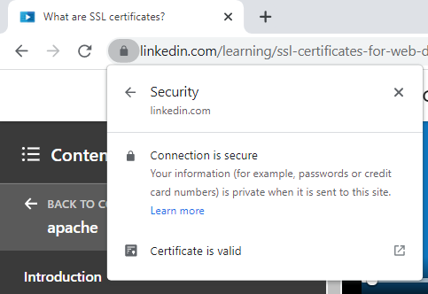
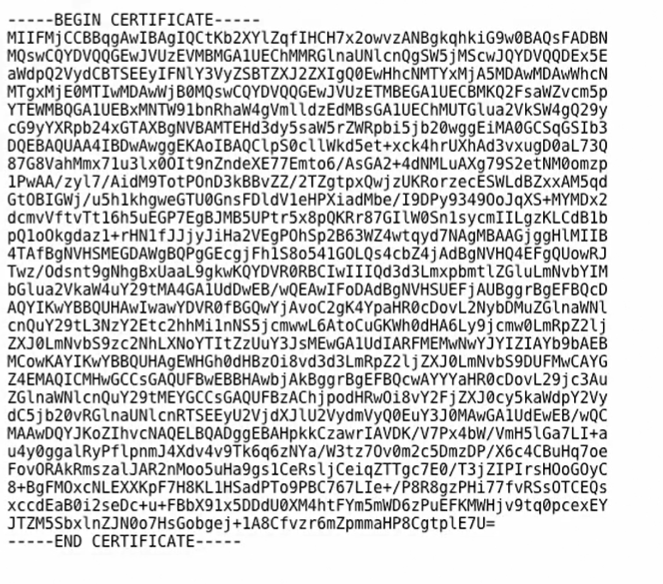

# What are SSL certificates?

- SSL certificate is that it's the thing that triggers the little padlock or perhaps the green bar at the top of their web browser
- What that indicates is that the webpage is using HTTPS for secure communication.
- The most basic way to communicate on the web is using HTTP, **HTTPS is the secure version of that.**
- When we talk about secure communication, **what we're talking about is data privacy and data integrity.** The fact that someone can't snoop on our data and see what's being sent, and they also can't modify it while it's in transit. 

## what does certificates certify?
- It certifies the ownership of a public key.
- It certifies who owns a particular public key and that's used for encrypting data that's sent between a browser and the remote server.
- **The SSL in the name comes from Secure Sockets Layer. That's just a protocol that's used for communication.** 

## SSL(Secure Sockets Layer) vs TLS(Transport Layer Security)

- In the earliest days of the web, if you wanted to use HTTPS, then it was using SSL  protocol along with your certificate and your public key in order to communicate.
- Now, in 1999, around the time that the web was about five years old, a new protocol for communication was introduced, which was TLS, or Transport Layer Security, and it's considered to be a superior version that's become far more common than SSL. 
- And the certificates really don't depend on which protocol we use. The certificate is just certifying the public key and these two communication protocols are using that public key while they communicate, so it really doesn't affect it.
- But the thing is that the name SSL has stuck. Even though TLS has now been around for five times as long as SSL, no one really uses SSL for communication anymore, they really use TLS, but we still call them SSL certificates.
- For this reason, you'll actually see them called by many names. Most commonly, they're SSL certificates, but some people call them SSL/TLS certificates.
- other names - public key certificates / digital certificates / identity certificates

## What's inside Certificates?

- since it certifies the ownership of a public key, so we need to know something about the person that owns it. So, **we have the organization, we have the URL, the state and the country, we also have the valid data range for the certificate and also issuer who owns this public key.**

- **Certificates aren't valid forever,** they're certified just for a certain amount of time and they're certified by an issuer.

- Someone who actually says, yes, I am going to validate the fact that this organization, this URL owns this public key. So, all of this basic information as well as some technical details, like what type of encryption it uses, is all going to be put into a file, a certificate file, and that's typically a file that ends in .crt or sometimes .cer.

- Now, the contents of that file is not gonna be readable easily by you. If you open up one of those files, you're going to see something that looks like this.

- What that actually is is an encoded version of that information, and it can be decoded. You can take it to a website, you can run some tools on your computer that will decode it, but this is a way to compress it down and make a good machine-readable code that can be passed easily over the internet.

## Why we need these  Certificates?

- **Their primary purpose is to be used with encryption.** It's so that we're able to encrypt communications and communicate securely between two different computers, usually a browsers and a remote server.

- They also tell us something about the identity of the person who owns a particular public key, so they have that purpose as well.
- And beyond that, they also tell us something about the trustworthiness of that person.
- 