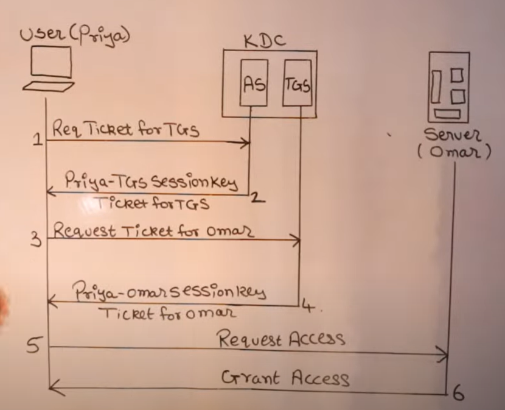

# Kerberos flow:

## Terms:
- KDC: Key Distribution Center 
- AS: Authentication Service
- TGS: Ticket Granting Service

## How Kerberos Operates:

- The Kerberos system operates through a set of centralized **Key Distribution Centers , or KDCs.** 
- Each KDC on your network contains a database of usernames and passwords for both users and Kerberos-enabled services.
- Centralizing this information eases the burden on administrators, as they now only need to maintain this single username/password database.
- In addition, it provides an advantage to security administrators, who now only have a small set of machines on which usernames and passwords are stored, and can specially harden and protect these machines accordingly.
- Kerberos provides a secure means of authentication over insecure networks.
- Instead of sending plain-text passwords over the network in the clear, Kerberos uses encrypted tickets to prove the identity of both end users and network servers
- These tickets are generated by the centralized Key Distribution Centers on behalf of users who wish to authenticate to the network
- When using Kerberos, user passwords are never sent over the network in the clear.
- While Kerberos does not directly provide authorization or auditing services, Kerberos’ ability to accurately identify both users and services allows programmers and administrators to provide authorization and auditing to further enhance the security of their network
- Note: for enabling kerberos auth for MSSQL host, we need to registrer it to KDC

## Flow:
[Reference](https://www.youtube.com/watch?v=OuJe0d1NGaM&t=8s)
- Priya as a user need to access resources from Omar

- First Priya need to authenticate herself to confirm her identity
- For this Priya will raise request to AS(Authentication Service) for ticket to TGS
- Its job of AS to provide ticket and session key for TGS to respective requestor.
- So **AS** first will verify identity of Priya and if it's a valid identity and then it sends sessionkey for TGS and ticket for TGS to Priya.
- Next Priya request Ticket from TGS to access Omar(Server)
- TGS will now provide sessionkey for Omar and Ticket for Omar to Priya so she can access Omar.
- Now Priya sends request to Omar with sessionkey and ticket obtained from TGS. 
- Omar will now grant access to Priya. 

Note:
- First step where Priya is sending request to AS to authenticate herself and receive sessionkey and ticket for TGS is onetime process only. 
- So step 1 and 2 is onetime only. 
- Next if Priya need to access some another resources then she will only starts from step3 to request ticket for another resource. 
- 