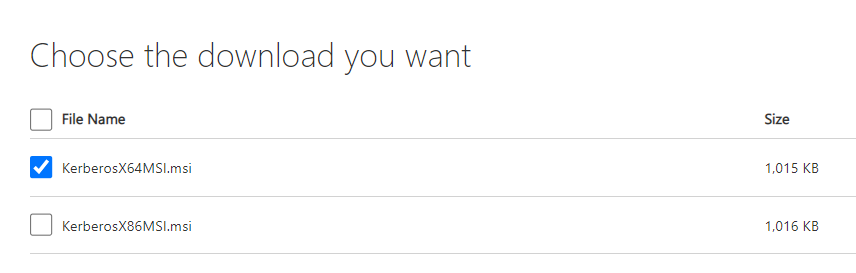
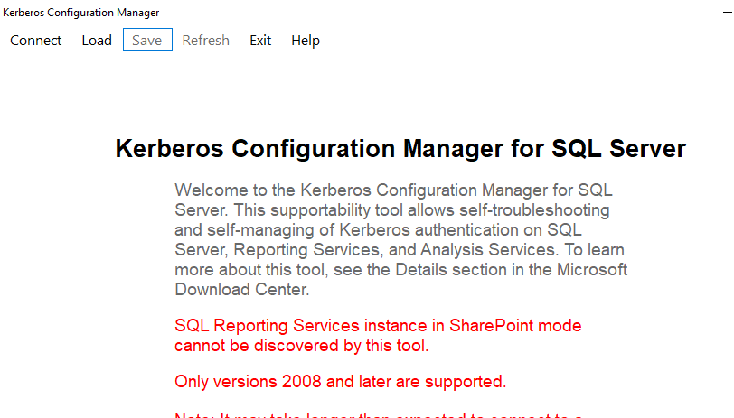

# Installation:

Steps:

## Plan your installation.
- You should take into consideration not only how many authentication clients you’ll be serving, but also where these clients are located
- While the bandwidth requirements for Kerberos authentication are miniscule, the important metric for Kerberos performance is the network latency between clients and the Kerberos KDCs.
- choose the platform and OS
- As a general rule, when your Kerberos KDC is unavailable, your users cannot acquire Kerberos tickets to authenticate to Kerberized services. Note that any tickets that clients may have in their credential caches will continue to work, but any attempts to acquire new service tickets during a KDC outage will fail.
- Finally, consider disk layout issues when installing the operating system on your KDCs.
- Kerberos requires the proper functioning of several external services. Notably, the clocks on all machines participating in your realm must be synchronized to within a few minutes, and a working DNS domain should be established with forward and reverse mappings to at least the Kerberos KDC and application servers you intend to Kerberize.

## Install the KDC software.

- **Heimdal**
  - Heimdal is a slightly newer player to the game, and like MIT, contains full support for Kerberos 5, Kerberos 4, and the ticket translator. Since it is developed overseas and, as such, is unencumbered by any export restrictions, Heimdal enjoys considerable support outside the U.S.
  - Heimdal makes a good choice if you are planning on using one of those Unix varieties to host your KDC.

- **Windows domain controllers**
  - The Kerberos implementation contained in Windows 2000 and above is the newest of the bunch.
  - The Windows implementation only supports Kerberos 5 and does not support any of the backwards-compatibility features that MIT and Heimdal include for Kerberos 4 clients.
  - The Windows domain controller supports only the RC4 encryption type as well as the older DES encryption type. It does not support the newer Triple DES that MIT and Heimdal support

- **MIT**:(not working)
  - For windows 10 we will install Kerberos from here: https://kerberos.org/dist/index.html
  - download: https://kerberos.org/dist/kfw/4.1/kfw-4.1-amd64.msi
    - ini file location: `C:\ProgramData\MIT\Kerberos5\krb5.ini`
    - installation dir: `C:\Program Files\MIT\Kerberos`
- AFS for Windows: (not working)
  - https://computing.help.inf.ed.ac.uk/afs-windows

- Microsoft Kerberos installation for SQL 
  - https://www.microsoft.com/download/details.aspx?id=39046
  - 
  - installation dir: C:\Program Files\Microsoft\Kerberos Configuration Manager for SQL Server\
  - to start server: C:\Program Files\Microsoft\Kerberos Configuration Manager for SQL Server\KerberosConfigMgr.exe
  - 
  - 
## Establish the Kerberos realm and create an administrative user principal.

## Add user principals to your realm.

## Install Kerberized server software, and install service principals for the server software as necessary.