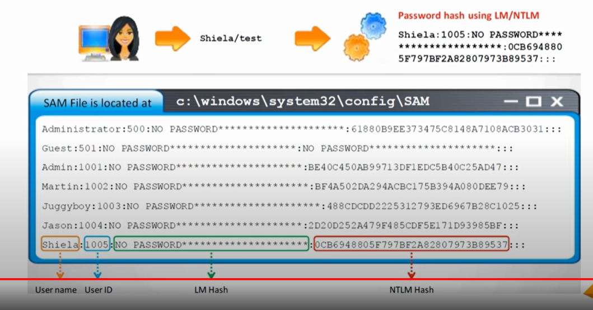

# NTLM

## SAM ( Security Account Manager)

- Windows stores user passwords in SAM or in the Active Directory Database in domain. 
- Passwords are never stored in clear text
- passwords are hashed and results are stored in SAM

### More about SAM
- its a database file in Windows XP, Vista, 8.1, 10 etc. that stores users passwords
- it can be used to authenticate local and remote users
- beginning with windows 2000 SP4, AD authenticates remote users
- SAM uses cryptographic measures to prevent unauthenticated users acessing the system 
- The user passwords are stored in a hashed format in a regitry hive either as LM hash or NTLM hash
- this file can be found in %SYSTEMRoot%/system32/config/SAM
- and is mounted on HKLM/SAM
- 

## NTLM Authentication:
- NTLM stands for New Technology LAN Manager
- it was launched in 1993
- its type of mechanism or hashing algorithm 
- The NTLM protocol types:
  - NtLM authentication protocol
  - LM authentication protocol (was used before)
  
- This protocol stores users passwords in SAM database using different hashing methods/algorithms

## Kerberos:

  

