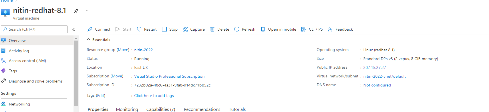
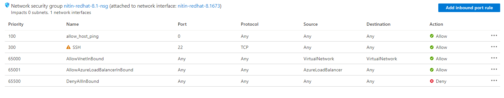

# create redhat 8.1 host from azure portal 

- redhat 8.1 created with following size: 



Size: 
```text
Size Standard D2s v3
vCPUs 2
RAM 8 GiB
```

- generated automatic .pem file. 
- Need puttyGen tool to convert .pem file to .ppk 
- Also add inbound rule to allow hosts ping 


- use putty for login and default user is **azureuser**

