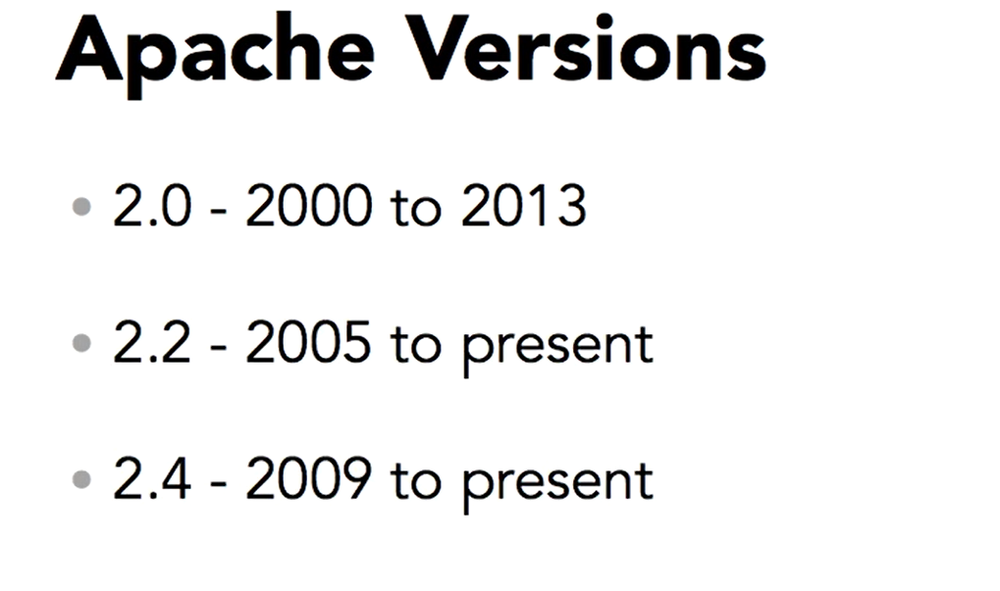

# Apache notes

### What is webserver? 
- A web server is a network service that serves content to a client over the web
- content includes    HTML documents, multimedia such as images, CSS style sheets, and client-side scripts such as JavaScript.
- Web servers are also known as HTTP servers, as they use the hypertext transport protocol (HTTP)

### Apache WebServer
- The Apache HTTP Server, httpd, is an open source web server developed by the Apache Software Foundation
- Apache HTTP Server is a web server application.
- developed since 1995
- handles large amount of traffic
- scales easily
- **Apache is a highly modular system meaning that functionality can be easily added to the core application.** 
- Modules encapsulate a specific group of functionality, including support for cryptographic protocols like SSL, server-side programming language support like PHP, and load balancing across multiple servers to handle large amounts of traffic

### Ways to install Apache: 

- using package management system : yum or apt or dpkg dependending on linux distro
- isntall manually from source code 
- Also precombiled binaries avaialble for some OS 
- 